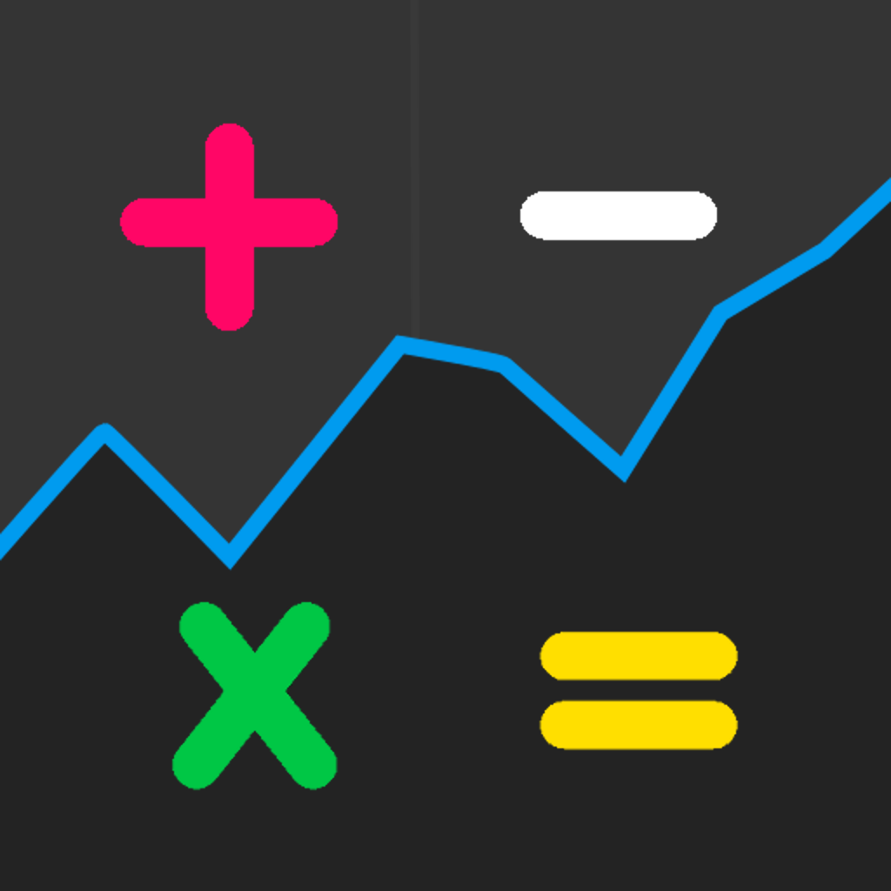
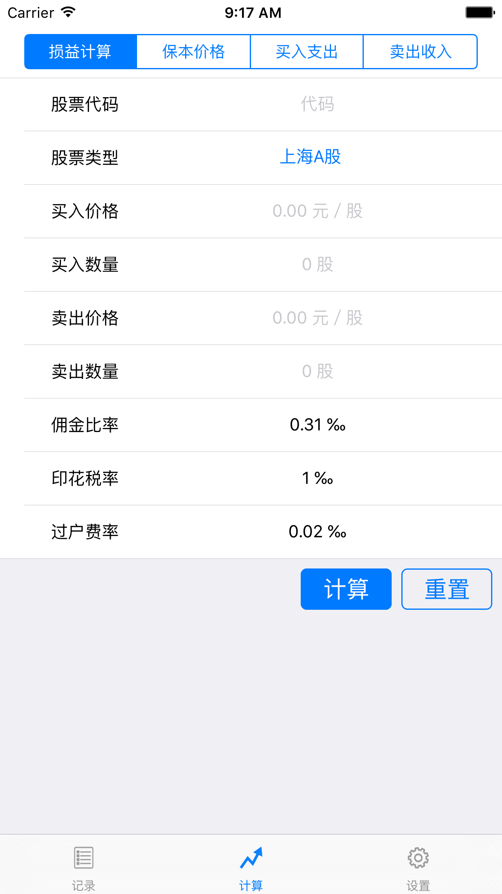
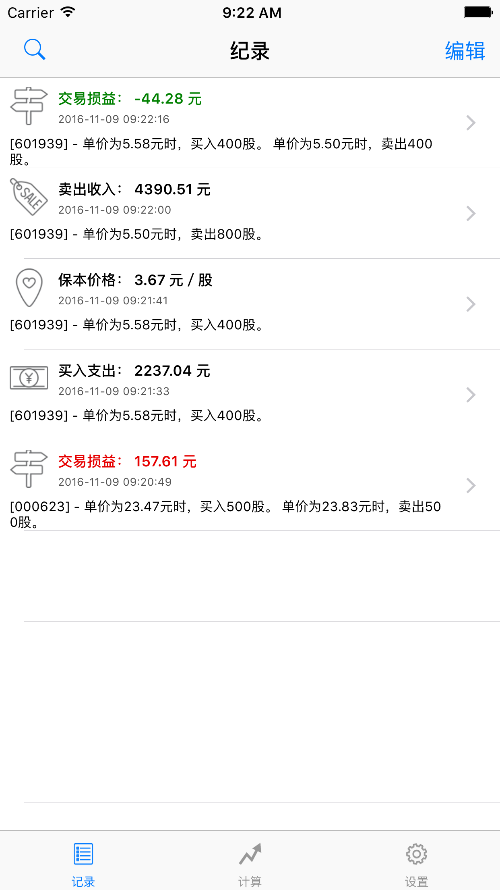
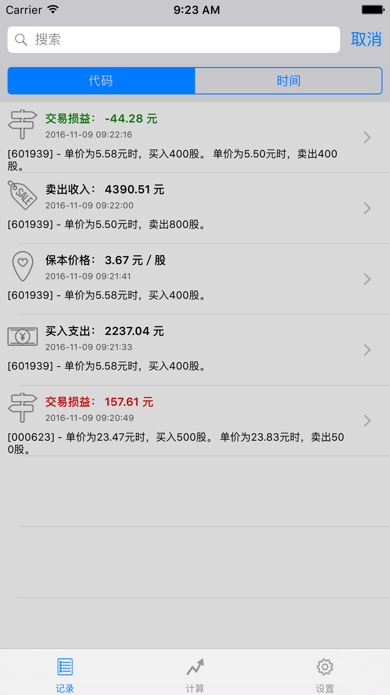
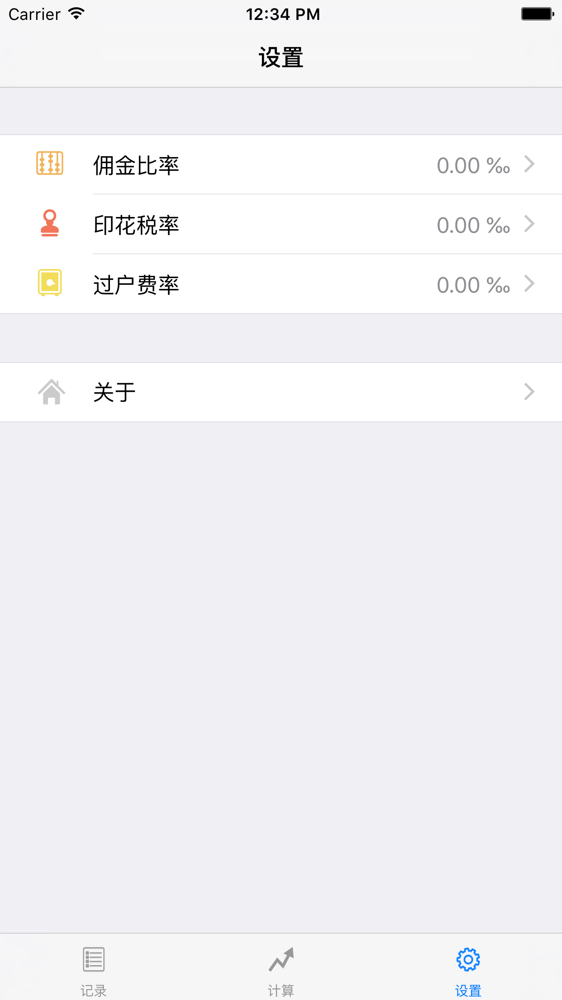

StockCalculator 
=======================

StockCalculator is an iOS App that calculates the breakeven price of the purchase and the profit or loss of the trade for China stock market participators.

针对中国A股市场的股票交易，进行交易成本和税费计算。
提供计算买卖损益和成本价格两种计算方式。
可自由定制税费比率。支持计算结果的保存，方便以后进行查看。

